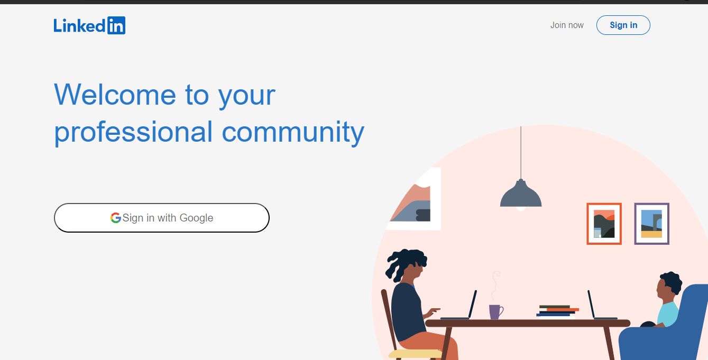

# LinkedIn Clone Project

**Description:**
This project is a LinkedIn clone built using ReactJS and Styled Components. It aims to replicate some of the core functionalities and features of the popular professional networking platform LinkedIn, including user authentication, profile creation, connections, and news feed.

**Features:**
- User authentication: Users can sign up, log in, and log out securely.
- Profile creation: Users can create and customize their profiles with personal information, skills, and experiences.
- Connections: Users can connect with other users, view their profiles, and send messages.
- News feed: Users can view and interact with posts and updates from their connections.

**Installation:**
1. Clone the repository: `git clone https://github.com/livinalt/linkedin-clone-project`
2. Navigate to the project directory: `cd linkedin-clone-project`
3. Install dependencies: `npm install`
4. Start the development server: `npm start`

**Usage:**
1. Sign up for a new account or log in with an existing account.
2. Customize your profile by adding personal information, skills, and experiences.
3. Connect with other users by sending connection requests.
4. Explore the news feed to view posts and updates from your connections.

**Technologies Used:**
- ReactJS: A JavaScript library for building user interfaces.
- Styled Components: A CSS-in-JS library for styling React components.
- React Router: A library for declarative routing in React applications.
- Firebase: A platform for building web and mobile applications with real-time database capabilities.

**Contributing:**
Contributions are welcome! Please follow these steps to contribute:
1. Fork the repository.
2. Create a new branch: `git checkout -b feature-new-feature`
3. Make your changes and commit them: `git commit -am 'Add new feature'`
4. Push to the branch: `git push origin feature-new-feature`
5. Submit a pull request.

**License:**
This project is licensed under the MIT License. 

**Credits:**
- This project was inspired by the Web3Bridge, functionalities and design of LinkedIn.

**Contact:**
For any inquiries or feedback, please contact livinalt@gmail.com